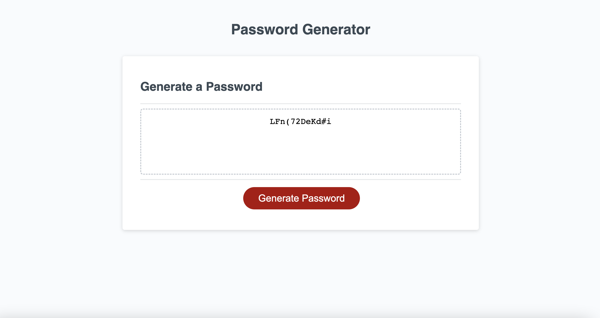

# password-generator

## Description 

This project is a Password Generator. It will generate a random password with the click of a button followed by a question asking what character types you would like to include or exclude. This will help save time by giving you access to a random passcode at any given time.

## Installation 
- Copy the code down from github
- Open it up in the webpage
- Click button and answer prompts 

## Usage 

```md

```

## Badges


